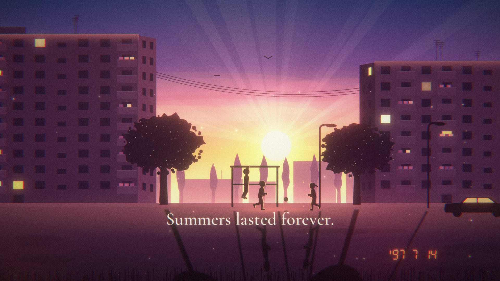

# AFTERGLOW

*A letter to the ’90s, the 2000s and the 2010s.*



A 3-minute motion-design short about nostalgia: why we miss those years, why our
memories seem to glow, and what we actually miss. 1920×1080, 24 fps, stereo.

**▶ Watch:** [`AFTERGLOW_1080p.mp4`](AFTERGLOW_1080p.mp4)

## The story

A cassette is rewound with a pencil and pressed into PLAY. The tape plays back a life:

1. **The ’90s.** Golden-hour courtyards between apartment blocks, a key on a string, a ball,
   the streetlights that meant *come home*, a mother calling from the balcony, “five more
   minutes”, an 8-bit console on Christmas morning, summer nights at the grandparents’.
2. **The 2000s.** The sound of dial-up, waiting for someone to come online, BUZZ!,
   T9 and 160 characters, a missed call that meant “I’m thinking of you”, one earbud each.
3. **The 2010s.** Vintage filters on the present — as if we already knew we’d miss it.
4. **Why do memories glow?** The same courtyard, grey and rainy, is repainted golden:
   memory isn’t an archive, it’s a painter. Everything happened for the first time.
   We don’t miss the ’90s — we miss who we were in them, and the people who were still here.
5. **We can’t rewind.** The tape runs out. But one day, today will glow like this too.
   So press record.

The full script with exact timings is in [`SCRIPT.md`](SCRIPT.md).

## How it is made

Everything — images, music and sound — is generated from code in this folder. No stock
footage, samples of existing songs or third-party artwork are used.

| Part | Where | How |
|---|---|---|
| Scenes | `web/js/scenes.js`, `env.js`, `props.js`, `figures.js` | Canvas 2D illustration: apartment blocks, silhouettes on a small FK rig, cassette/deck, CRT TV and 8-bit game, dial-up desktop and messenger, a candybar phone with a 1-bit LCD, a smartphone, the village at night. |
| Look | `web/js/post.js` | WebGL2 post chain per frame: dual-Kawase bloom and diffusion, film halation, chromatic aberration, filmic shoulder, grade/split-tone/fade, light leaks, VHS/CRT, vignette, grain, dust and gate weave — keyframed per scene in `web/js/timeline.js`. |
| Captions | `web/js/text.js` | Word-by-word blur-to-focus reveal (Cormorant Garamond). |
| Renderer | `render/render.mjs` | Serves `web/`, drives headless Chromium (SwiftShader WebGL2) frame by frame with a deterministic clock, streams raw RGBA frames over HTTP into ffmpeg; renders in parallel chunks. |
| Soundtrack | `audio/` | Original score (80 BPM, D major) composed as MIDI in Python, rendered with FluidSynth and the MuseScore General / FluidR3 soundfonts, plus synthesized sound design (tape, dial-up, BUZZ, crickets, projector…), mixed and mastered in numpy/scipy. |

## Rebuild it

Requirements: Node 22 with Playwright’s Chromium, ffmpeg, Python 3 with numpy, scipy,
soundfile, mido (and pyloudnorm), FluidSynth with the `musescore-general-soundfont-lossless`
and `fluid-soundfont-gm` packages.

```bash
cd afterglow
python3 audio/build.py                                # -> out/audio/afterglow_mix.wav
node render/render.mjs --video --workers 2            # -> out/segments/*.mkv
render/encode.sh                                      # -> AFTERGLOW_1080p.mp4 (+ out/AFTERGLOW_1080p_HQ.mp4)

# preview single frames while editing (seconds):
node render/render.mjs --stills 24,71.2,140 --tag look
```

## Credits & licences

- Fonts (SIL Open Font License, see `web/fonts/licenses/`): Cormorant Garamond, Caveat,
  IBM Plex Mono, Inter, Press Start 2P, VT323, Fraunces.
- Soundfonts: MuseScore General (MIT; Splendid Grand Piano is public domain, VSCO strings CC0)
  and Fluid R3 GM (MIT).
- Story, visuals, music and sound design: original, generated for this project.
